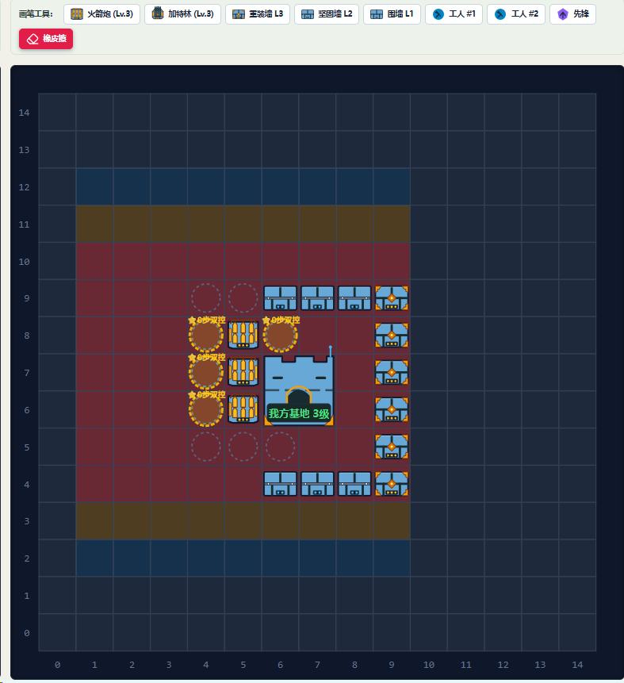

# 集中升级与双工人维修

升级策略为0.3.6；维修说明更新至0.3.8，2026-09-22。独立任务、墙掩护、让行和动态备货见[工人协作](WORKER_COORDINATION.md)。按用户新蓝图调整升级投资，涉及R03建造/死亡、R06升级券/修复包；官方规则不变。保留0.3.5任务模块和既有U形阵型。修改前源码及文档保存于[0.3.5快照](../../reports/baselines/v0.3.5-source.zip)和[哈希清单](../../reports/baselines/v0.3.5-manifest.json)，历史0.3.2基准继续保留。

## 1. 蓝图与最终目标

上图是左侧基地示例，基地左上角为(6,7)，占2×2格。实际运行以基地坐标计算偏移，不把图中绝对坐标写死；基地在右侧时自动水平镜像。蓝图只定义策略目标，不改官方合法建造权限。

| 类别 | 图中坐标 | 相对基地左上角 | 最终等级 |
|---|---|---|---|
| 正面中央两墙 | (9,7)、(9,6) | dx=3，dy=0/-1 | 3 |
| 正面外围四墙 | (9,9)、(9,8)、(9,5)、(9,4) | dx=3，dy=2/1/-2/-3 | 3 |
| 上下两翼六墙 | (6..8,9)、(6..8,4) | dx=0..2，dy=2/-3 | 2 |
| 三座后排火箭 | (5,8)、(5,7)、(5,6) | dx=-1，dy=1/0/-1 | 3 |
| 基地 | (6,7)起的2×2 | 原地 | 不升级；保留观测等级 |

镜像以基地中心为轴，`dx→1-dx`，y偏移不变。额外已有墙按同样几何分组；非正面列的墙目标2级，旧局已经3级的两翼墙不会降级或拆除。

## 2. 完整阶段顺序

仍先用75金币造3座火箭，再采石和完成12面U墙，之后进入升级。保留第一天不升墙的约束：第一天集中升满首炮后筹资等待，不提前跳过中央墙去升级第二台。第二天起执行以下阶段，已有达到目标的建筑跳过；基地在任何阶段均不升级：

| 顺序 | 目标 | 说明 |
|---|---|---|
| 1 | 一台火箭1→2→3 | 有2级火箭时优先继续它，不把三台先平均升2级 |
| 2 | 正面中央两墙升3级 | 两墙先补齐2级，再补齐3级；其余墙暂不升 |
| 3 | 第二台火箭1→2 | 此处仅到2级，不提前买其2→3券 |
| 4 | 正面外围四墙2→3级 | 四墙先全部到2级，再全部到3级；两翼保持原等级 |
| 5 | 所有火箭补齐3级 | 先完成已为2级的第二台，再让第三台1→2→3 |
| 6 | 上下两翼六墙升2级 | 最后完成这批墙，不购买两翼2→3券 |
| 7 | 双工人专职维修 | 白天轮流批量补货，夜间均在墙内，不继续普通采矿或购券 |

这是用户确认的完整顺序。**不购买或使用StationUpgradeVoucher1/2，即使持有旧基地券或基地残血，也不插入基地升级。** 蓝图上基地显示3级仅作位置参考，当前文字要求不升基地优先于该标注。已有更高等级基地保留原状态。

默认官方价格下，首炮升级250、中央两墙100、第二炮到2级100、外围四墙200、其余炮补满400、两翼六墙120，共1170金币（不含建造及修复包）。实际采购读取当前商店价格，不使用这组金额替代预算校验。兼容旧混合炮型时优先火箭，最终仍使已有三炮达到3级。

目标火箭选择规则为：火箭优先、当前等级高者优先、同级按ID。升级到2级后仍选择同一座，避免因工人位置改变而切换。选择依据每轮真实建筑观测；失败使用不会推进阶段，建筑被摧毁或重建后重新计算。

墙组内先选尚未达标的最低等级；具体使用时，仍按迎敌方向的列、低血比例、路程和ID排列。中央两块都到3级后才推进外围；两翼最终按前到后升2级。升级成功恢复满血由平台结算，程序只提交use，不自行改血量。

## 3. 批量采购与配送

墙券按当前组、当前等级的缺口批量购买：中央组最多2张，外围组最多4张，两翼组最多6张；扣除全队存活角色持有券、本轮已买券，并加回本轮已使用量后计算实际缺口，避免多人重复购买。金币不足不跳过当前目标买其他便宜券。

集中升炮需要两种券。当前火箭为1级时，采购需求按`WeaponUpgradeVoucher1×1`、`WeaponUpgradeVoucher2×1`排列。先保证一级券到位，再允许预购这台的二级券。每角色每轮只能购买一种商品，因此不是一条buy买两种券，而是在同一次到店行程的连续回合分别购买。工人在商店旁优先补齐需求，再去配送；资金不足以预购第二种时可先使用已有一级券。仅当前需要一口气到3级的火箭允许这种预购；中央墙之后第二台只需到2级，此时禁止预购其二级券，保留正面墙升级预算。

仍使用官方报文中的实时价格、背包容量和共享金币，不计入本轮尚未到账的卖矿收益。建设阶段预留缺炮费用；升级未完成时，第三天起原维修工保留动态修复包预算（第3天5包，此后每日+3，并参考昨日确认用量）。已有库存不足、商品缺失或路径不可达时不发非法购买。

## 4. 完成后的双维修模式

`upgrades_complete()`要求：基地存活（不要求升级），三炮都3级，配置墙位全部有存活墙，正面墙3级、两翼墙至少2级。不能仅因`upgrade_candidates()`为空就认为完成，因为第一天限制、缺墙或缺炮也可能返回空候选。

达到目标即启用双维修，不必额外等待第三天。两名存活工人按上下半区分工，白天和夜间均以墙内待命/维修为主，不再执行普通挖矿、卖矿、购券。开拓者继续夜间操炮、白天可做任务；完成模式禁用宝藏购物，后续可支出的金币专供WallFixer。

沿用严格低于30%的阈值：2级墙HP<450、3级墙HP<600触发，等于阈值不修。同回合不能两人修同一面墙，前往维修的目标也在本轮登记，另一人优先处理其他危墙。墙内通路仍是上/下排各3格、正面2格共8格，进入之后的巡护限定在其中，避开炮和开拓者站位。没有损坏墙或没有修复包时待命；夜间不从墙内发起新采购；若入夜已经位于安全商店旁，允许买足缺包后回岗。

### 白天补货

紧急维修先于补货。一次只派一名采购工，另一人保持值守；采购工买完并回到墙内后才交接给下一人。`GameMemory.repair_supplier_id`记录采购身份，避免每轮因距离变化换人。死亡/消失时由存活工人接替；仅一名存活工人时不虚构第二个守卫。

完成模式不再把库存上限固定为5包，而把可买数量在工人之间尽量均衡分配：

1. 计算各人工人当前WallFixer数、剩余背包空间和可用金币能买的数量。
2. 每个可买修复包先分配给每日需求缺口更大、尚有空间者，满足动态日需求后均衡库存，同数按ID。
3. 采购工批量买到自己的目标，另一人的份额保留到其下一次采购行程。

例如两人各5包、还有200金币、单价10，则各补10包；先一人买10包并回岗，再另一人买10包。零价格按剩余容量分配；背包满、余额不足一包、缺商品或无法及时往返时保留金币，不丢弃物品、不伪造购买。修复包只在本人背包可用，不能假设全队共享实体库存。

是否来得及采购按去商店路径、购买一轮、商店到内侧的距离估计与`return_margin=4`判断。黄昏停止新采购并回岗。该估计不能预见将来堵路；不是绝对安全保证。

## 5. 毁墙补建与恢复

缺墙仍通过模板墙位减存活墙检测。墙消失或HP=0时不再满足“目标已完成”；白天恢复补墙/筹石优先。已进入过双维修的队伍，夜间两名工人仍值守剩余城墙，不能建墙，保留石材到次日。补墙之后按该位置的目标重新升级：中央/正面到3级，两翼到2级。重新满足全部目标后自动回到双维修。缺炮和基地存活状态也按每轮真实观测判断，不依赖永久“完成”标志。

这意味着“金币全买修复包”适用于防线目标持续达标时；防线被毁之后会先恢复建筑目标。只保持低血而未被毁不会退出双维修，也不会购买两翼的3级券。

## 6. 关键模块、函数与参数

| 位置/函数 | 参数→返回 | 作用 |
|---|---|---|
| `upgrade_policy.wall_group(strategy, wall)` | Strategy、Unit→0/1/2 | 相对基地分为中央、外围、两翼 |
| `wall_target_level(strategy, wall)` | Strategy、Unit→2/3 | 最终墙等级 |
| `focused_weapon(weapons)` | 武器列表→最多一项列表 | 单炮集中升级，等级/ID稳定选择 |
| `upgrade_candidates(strategy)` | Strategy→建筑列表 | 首个未完成阶段，所有候选均使用同种券 |
| `second_weapon_pending(weapons)` | 武器列表→最多一项列表 | 判断第二台是否仍需到2级，用于阶段和预购限制 |
| `pending_walls(strategy, group, target)` | 策略、分组0/1/2、目标等级→列表 | 返回该组尚未达标的最低等级墙 |
| `purchase_needs(strategy)` | Strategy→(物品名,数量)列表 | 当前阶段，仅当前火箭目标为3级时可附加第二种券 |
| `upgrades_complete(strategy)` | Strategy→bool | 完成模式门槛，包含缺口检测 |
| `Strategy.upgrade_candidates/upgrades_complete` | 无→列表/bool | 委托独立策略模块，供消费/采购/维修共同调用 |
| `Strategy.worker(role)` | Unit→None | 补墙→商店旁补齐当前券→用券→补炮→卖矿/购券/采矿；完成模式由run提前交给WallGuard |
| `WallGuard.full_time` | bool | 是否双工人全天维修 |
| `WallGuard.is_guard(role)` | Unit→bool | 单维修工模式或完成后的全部存活工人 |
| `final_stock_targets(workers)` | 工人列表→ID到目标包数 | 资金/容量内均衡分配批量补货 |
| `stock_missing(worker=None)` | 可选Unit→数量 | 完成前默认主维修工，完成后读指定工人的目标及本轮买/用 |
| `final_daytime(role)` | Unit→None | 先抢修，再单人补货与回岗 |
| `nighttime(role, urgent_only=False)` | Unit、bool→是否安排动作 | 墙内维修/待命；urgent_only用于白天先判断抢修，没危墙不先占用采购动作 |
| `repair_supplier_id` | GameMemory字段，int或None | 采购工及返岗过程，跨回合保存 |
| `maintenance_claims` | 本轮set[int] | 维修/升级配送目标去重，不假装动作已成功 |

无新HTTP路由，0.3.7新增备货增长配置，详见工人协作文档。`repair_start_day=3`控制单维修工启用日期；`repair_stock=5`是动态日需求基数，`repair_stock_per_day=3`控制每日增长；`repair_threshold_percent=30`在两种模式都生效。日志新增`full_time_repair`和`repair_supplier`，原`repair_worker`表示最初固定的主维修工，不能独自代表完成模式的全部工人。

## 7. 验证与边界

[0.3.6报告](../../reports/VALIDATION-v0.3.6.md)记录全部测试、80份合成观测、HTTP及源码哈希。新案例覆盖集中升炮、两侧分组次序、两翼封顶2级、基地不升级、第二炮停2级、预购券、双人不同目标维修、30%边界、白天轮流补货和回岗、夜间不出门、容量/零价格、死亡接替和毁墙重新进入恢复流程。原连续反馈夹具继续验证整条采购/升级序列，旧批量测试改用当前4面外围墙阶段。

这不是完整比赛模拟。机器人未来位置、突发多墙致命伤、路径被占、修复包耗尽和日照估计误差仍可能影响效果。没有跑官方平台对局，不能据本地测试宣称胜率或存活时间提升。重启服务加载新版即可；旧局以实际建筑等级和库存继续计算，不会强制拆除现有建筑。

0.3.8升级顺序保持，普通工人夜间也可采购、配送和使用升级券；指定维修工在危墙维修之后可沿内侧完成升级。函数与限制见[昼夜统一调度](WORKER_SCHEDULE.md)。
