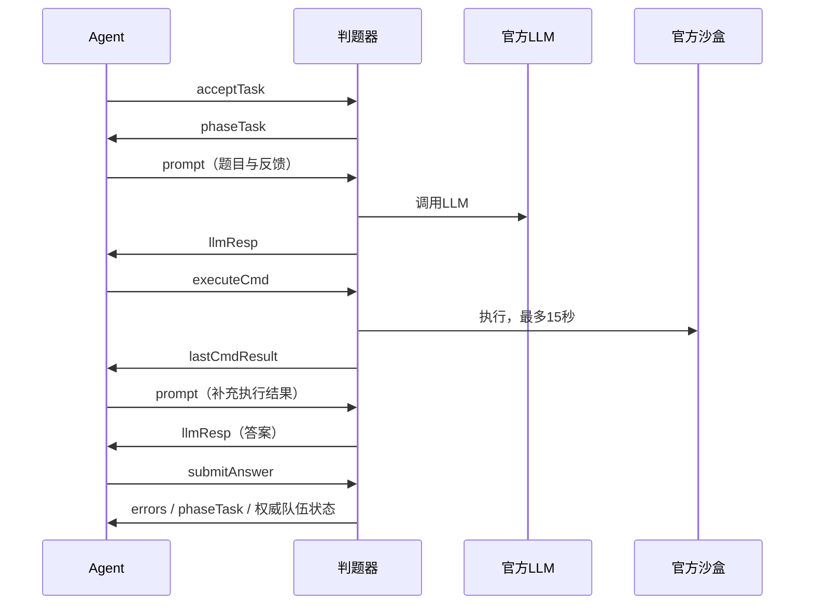

# 协议与 LLM 协作

官方依据为根目录 [接口文档.md](../../接口文档.md)。本文描述工程接入，不替代官方协议。

## 1. HTTP 收发

```text
判题器 → POST 任意路径 → app.server.Handler
       → TurnService.decide(payload)
       → application/json; charset=utf-8
```

响应始终包含三个官方字段：

```json
{
  "roleCommandMap": {},
  "prompt": "",
  "executeCmd": ""
}
```

角色编号从请求读取，不固定成 `10010` 或 `20010`。JSON 对象 key 是字符串；攻击指令以武器ID为key，`controllerId` 也是字符串。`targetPos` 始终为坐标数组，单目标也不省略数组。

以下示例只说明结构，坐标是否合法取决于当前观测：

```json
{
  "roleCommandMap": {
    "501": {"action": "move", "targetPos": [{"x": 8, "y": 24}]},
    "601": {
      "action": "attack",
      "controllerId": "504",
      "targetPos": [{"x": 16, "y": 20}, {"x": 16, "y": 20}]
    }
  },
  "prompt": "",
  "executeCmd": ""
}
```

攻击示例要求 `601` 是二级加特林或火箭，且 `504` 本轮未执行其他动作。合法空动作使用空 map，没有新增 `idle` 动作。

0.3.0的默认策略只使用开拓者作为`controllerId`，每轮最多发出一座炮的攻击；两个工人可同时各输出一条`collect`或`move`。`controllerId`必须是本轮真实开拓者ID，不能固定成示例值。三炮轮换读取各炮的`cooldown`，并不向HTTP请求或响应新增轮换字段。

有效请求返回200。输入协议错误返回400，超大请求413，读取超时408；内部决策异常记录 traceback 后以200返回官方结构的空动作，进程继续服务。降级不宣称策略执行成功。应用不向外部 LLM 服务发HTTP请求，LLM与沙盒均由判题器根据返回字段调度。

原 `response.txt` 含重复key和语法问题，仅作动作目录保留；不能直接作为 JSON 响应模板。根目录 `request.txt` 保持原样，其缺失的可选/样例字段由解析层兼容。

## 2. 十二种动作

| 动作 | 必要附加字段 | 主要本地校验 | 基线是否主动选择 |
|---|---|---|---|
| move | targetPos[1] | 八邻格、当前可见障碍、目的格预留 | 是 |
| attack | controllerId、targetPos | 夜晚、控制距离、射程、冷却、等级数量、加特林90° | 是 |
| sell | name，num默认1 | 小贩相邻、当前收购清单、矿物库存 | 是 |
| buy | name，num默认1 | 商店相邻、当前商品价、共享金币、容量 | 是 |
| build | name、targetPos[1] | 工人白天、当前建造区域、距离、材料、武器总数 | 默认启用基地周围布局 |
| remove | targetPos[1] | 工人、相邻己方墙 | 扩展入口 |
| acceptTask | 无 | 开拓者、无活跃任务、己方有效任务点邻域 | 是 |
| submitAnswer | taskAnswer字符串 | 活跃任务、存活开拓者 | 是 |
| summonTreasure | targetPos[1]、item数组 | 开拓者、距离、任务物品及数量 | 有合格推理计划时 |
| use | name；部分物品需targetPos[1] | 库存、券等级、建筑范围、每日召唤尝试数 | 有对应库存时 |
| drop | name | 已持有物品 | 扩展入口 |
| collect | targetPos[1] | 工人、矿点相邻、背包容量 | 是 |

`remove` 当前保守限制为己方墙；没有推断敌墙可拆权限。策略不会主动丢弃任务用品。石矿剩余量不在输入中，程序不会自行生成余量或提前假定矿点耗尽。

所有校验针对当前已知观测，不能保证未来同时结算一定成功。敌方隐藏单位、移动中的机器人、对方争抢、任务/宝藏条件等仍以判题器结果为准。

## 3. 自进化任务交互



LLM 返回给本程序的约定是内部协作格式，不要求判题器新增字段：

```json
{"action": "execute_command", "command": "python3 inspect_task.py"}
```

或：

```json
{"action": "final_answer", "answer": "{\"answer\": 42}"}
```

任务回复优先交给用户控制器解析，支持v2 JSON、代码块、对象前后说明文字和旧XML；以action选择命令或答案分支，兼容旧executeCmd/taskAnswer单一非空分支。新闻仍使用独立严格JSON解析。过期轮次或不同任务的回复不消费。v2的command映射顶层executeCmd，answer映射submitAnswer.taskAnswer，沿用用户解析器的字符串处理。输出上限命令32KiB、答案128KiB、LLM回复256KiB；拒绝NUL或非法编码。这些是工程限制，不是官方新增规则。

`lastCmdResult` 保留原文，另外解析为：

| 原始头 | status | exit_code |
|---|---|---|
| 空字符串 | empty | None |
| [exitCode:N] | exited | N，包含非零和负值 |
| [TIMEOUT] | timeout | None |
| [JUDGER_ERROR] | judger_error | None |
| 未识别头 | unknown | None |

结尾 `[TRUNCATED]` 独立记录，不抹掉退出码。官方超过64KB输出的截断由判题器实施；Agent不会补造被截断的数据或把超时改成成功。收到`errorCode=2`时按用户控制器保存失败经验、退出并冷却；判题器以历史最高通过率结算，程序不自行覆盖得分。

`TaskService.active(..., defense_due=False)`在需要开拓者回防时返回空prompt/executeCmd并不保留角色，允许策略移动或操炮。这可能因离开范围结束任务；程序等待下一轮`phaseTask`，不自行宣告任务结束，也不继续执行已让位任务的LLM命令。

任务开始轮及timeout预算、SOP/Skill、输出裁剪、api_diag诊断、失败冷却与Postman逐轮样例，见[任务模块接入](TASK_INTEGRATION.md)。

## 4. 普通新闻与宝藏

新闻按日和内容去重，保留本局积累，供长上下文推理。当前商店与收购价一起传给 LLM。内部回复格式：

```json
{
  "treasure": null,
  "mineClosures": [
    {"name": "iron", "startDay": 2, "endDay": 3, "evidence": "新闻明确说明的依据"}
  ]
}
```

若线索足够，`treasure` 可以为：

```json
{
  "targetPos": {"x": 3, "y": 4},
  "items": ["AcientTablet", "StarSand"],
  "startRound": 201,
  "endRound": 210,
  "confidence": "high",
  "evidence": "完整地点、时间、物品推理依据"
}
```

示例不是游戏答案。名称必须来自当前商品清单，拼写保持 `AcientTablet`。不接受矿物、升级券或已知普通消耗品作为推理计划的任务用品。LLM可能推错；本地只能校验结构和可执行条件，无法提前证明隐藏宝藏答案。

普通 prompt 按发出次数计数，最多3次/日。只在新闻有新内容或上次结果格式无效/献祭失败需复核时生成，任务期间暂停普通新闻分析。任务中的调用不消耗该额度。

## 5. 服务扩展契约

在 Python 中使用完整服务：

```python
from app.config import Settings
from app.service.turn_service import TurnService

service = TurnService(Settings.load("config.local.json"))
response = service.decide(payload)
```

源码运行时需要把 CoreGeek 和 CoreGeek/src 放在 Python 模块路径中；`main3.py` 和工具脚本已处理。服务实例应在整个比赛进程复用，不应每个回合重建，否则会失去额度、新闻及任务方法记忆。
