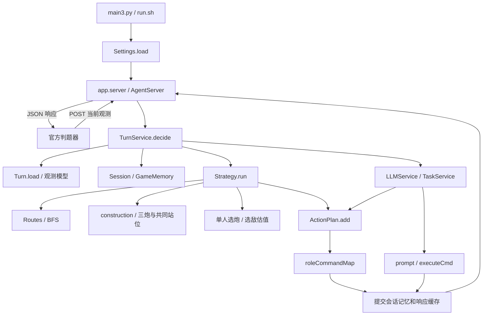
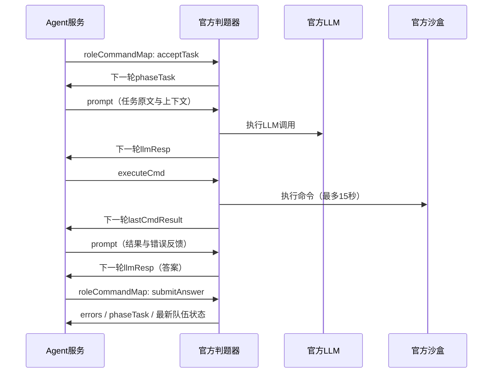

# Future War / CoreGeek

基于本目录《未来战争》v1.0 任务书、接口文档和 `DEVELOPMENT_RULES.md` 实现的参赛 HTTP Agent。保留 CoreGeek 的 `main3.py → src/agent` 基础结构，新增 `CoreGeek/app` 应用层。运行仅依赖 Python 标准库，Python 3.10 及以上。

当前程序版本为 `0.3.4`，声明位置是 [CoreGeek/pyproject.toml](CoreGeek/pyproject.toml)。在0.3.3上增加工人机器人避险、升级券批量购买，以及第三天起一工人备5个修复包并夜间墙内值守、墙血低于30%时维修。保留原升级顺序：第一天只升级火箭，第二天起火箭2级→墙2级→火箭3级→墙3级→基地，墙按迎敌方向由前到后升级。U形布局与P站位保持。优先使用初始75金币建三座火箭，再攒石建墙；夜间开拓者轮换操炮，普通工人避险采矿，第三天起专人修墙。本文说明当前代码实际行为；协议、策略和工程参数分别标注，方便后续定位修改位置。

## 阅读导航

- [快速开始](#快速开始)：启动服务、检查入口。
- [目录与模块职责](#project-layout)：完整文件树、各层边界。
- [整体架构与回合流程](#architecture)：请求如何变成三个响应字段。
- [配置、命令行与关键参数](#configuration)：参数含义、默认值、读取位置和修改影响。
- [数据模型与坐标约定](#models)：`Turn`、`Unit`、`Pos` 等对象及字段映射。
- [应用层关键函数](#application-api)：网络、会话、记忆、LLM、任务服务。
- [策略层关键函数](#strategy-api)：动作校验、寻路、角色策略、战斗估值。
- [任务、新闻与宝藏流程](#task-workflow)：跨回合数据如何传递。
- [代码调用与扩展示例](#examples)：如何调用服务，如何添加新策略。
- [测试、回放与报告](#verification)：工具参数、测试分工、结果解释。
- [修改定位与常见问题](#maintenance)：按实际问题找到代码入口。
- [当前限制与后续工作](#limitations)：已实现功能与待确认部分。

首次阅读建议先看目录和架构，再看 `TurnService.decide → Strategy.run → ActionPlan.add` 三个函数。只调整采矿、武器组合等策略时，优先阅读配置和策略层章节。

## 快速开始

在本目录执行：

```powershell
python CoreGeek/main3.py 8080
```

比赛 Linux 环境入口：

```bash
bash run.sh 8080
```

监听 `0.0.0.0`，任意路径接收 POST JSON；`GET /health` 可用于检查进程状态。启动前无需安装第三方运行依赖。进程日志写入 stderr。

**默认即可执行“三座火箭 → 采石 → 建围墙”，无需另建配置文件。** 按用户指定的“基地周围都可建造”假设，默认采用用户设计图的12格U形墙与后排竖排三火箭，墙与基地之间保留一格宽维修通路，后方开口；开拓者站在中间火箭后侧P。按实际基地所在左右半区决定是否水平镜像。该布局记录为本地假设；后续填写的已确认布局会优先覆盖它。

## 文档入口

| 文档 | 用途 |
|---|---|
| [CoreGeek 使用说明](CoreGeek/README.md) | 启动、配置、回放、测试、部署 |
| [开发与维护文档](CoreGeek/docs/DEVELOPMENT.md) | 分层架构、调用链、状态管理、修改方式 |
| [接口与 LLM 协作](CoreGeek/docs/PROTOCOL.md) | 官方收发结构、动作约束、异步任务交互 |
| [规则覆盖与差异登记](CoreGeek/docs/RULE_COVERAGE.md) | R01–R08、D01–D08、仍待确认的行为 |
| [开局防御策略](CoreGeek/docs/OPENING_DEFENSE.md) | 三火箭布局、攒石建墙、单人轮换、测试与升级步骤 |
| [实现现状](DEMO.md) | 本轮完成范围与未完成的外部验证 |
| [v0.3.4验证报告](reports/VALIDATION-v0.3.4.md) | 当前源码测试证据、哈希、验证边界；旧报告独立保留 |
| [开发规则](DEVELOPMENT_RULES.md) | 本地开发约束与官方规则索引，原文保留 |
| [任务书](任务书.md) / [接口文档](接口文档.md) | 原始比赛规则与接口定义，原文保留 |

## 本地验证

```powershell
python CoreGeek/run_tests.py
python CoreGeek/tools/smoke_server.py --output reports/http-smoke-v0.3.4.json
python CoreGeek/tools/replay.py request.txt --output reports/sample-response-v0.3.4.json
python CoreGeek/tools/validate.py --cases 20 --output reports/validation-v0.3.4.json
```

`replay.py` 只计算响应，不执行响应中的沙盒命令或 LLM 请求。验证脚本生成的压力结果是合成观测检查，不是比赛模拟、官方难度或胜率。

<a id="project-layout"></a>

## 目录与模块职责

```text
futurewar/
├── README.md                         # 项目总览、架构、关键函数与参数（本文）
├── DEVELOPMENT_RULES.md              # 团队开发约束，含R01–R08和D01–D08索引
├── 任务书.md                         # 官方游戏规则原文
├── 接口文档.md                       # 官方HTTP/JSON接口原文
├── request.txt                       # 官方请求样例，测试和离线回放的输入来源
├── response.txt                      # 官方动作目录样例，不能当有效JSON直接读取
├── DEMO.md                           # 当前实现范围和外部验证缺口
├── run.sh                            # 仓库级入口，转交CoreGeek/run.sh
├── .gitignore                        # 忽略缓存、构建中间文件和本地配置
├── reports/
│   ├── VALIDATION.md                 # 人类可读的历史验证报告
│   ├── VALIDATION-v0.3.4.md          # 避险、批量采购与夜间修墙验证报告
│   ├── validation-v0.3.4.json        # 本版测试、压力、环境与源码哈希
│   ├── http-smoke-v0.3.4.json        # 本版真实进程HTTP验证
│   ├── sample-response-v0.3.4.json   # 本版对原样例的响应
│   ├── validation.json               # 测试/压力结果、环境、源码和规则文件SHA256
│   ├── http-smoke.json               # 实际启动进程后的HTTP检查结果
│   └── sample-response.json          # 原请求样例生成的离线响应
└── CoreGeek/
    ├── README.md                     # 子项目运行指南、模块/函数速查
    ├── main3.py                      # Python启动入口，处理端口、配置、日志和模块路径
    ├── run.sh                        # 比赛启动脚本，最终exec Python进程
    ├── pyproject.toml                # 包名、版本、Python要求、setuptools打包规则
    ├── config.example.json           # 配置模板，不包含已核验建造区域
    ├── config.local.json             # 可自行复制模板创建，不随代码提交
    ├── run_tests.py                  # unittest发现与执行入口
    ├── app/
    │   ├── __init__.py               # app包声明
    │   ├── config.py                 # Settings配置模型、配置校验、建造位置换算
    │   ├── server.py                 # HTTP网络适配、响应序列化、错误处理
    │   └── service/
    │       ├── __init__.py           # 服务包声明
    │       ├── turn_service.py       # 整个回合的编排、缓存、锁和事务式状态提交
    │       ├── memory.py             # 额度、新闻、任务、失败反馈和开局布局记忆
    │       ├── llm_service.py        # 构造prompt、消费LLM回复、校验新闻推理结果
    │       └── task_service.py       # 活跃任务期间的答案/沙盒命令处理
    ├── src/
    │   └── agent/
    │       ├── __init__.py           # agent包声明
    │       ├── protocol.py          # 观测数据模型、规则常量、坐标与命令构造器
    │       ├── grid.py              # BFS/风险优先Dijkstra、目标邻域和巡护区域
    │       ├── worker_safety.py     # 机器人风险图
    │       ├── wall_guard.py        # 维修工分配、备货、回岗和夜间修墙
    │       ├── actions.py           # 十二动作校验、共享金币和目标格预留
    │       ├── construction.py      # 在当前建造格内选三炮位置与共同操控格
    │       ├── combat.py            # 弹道相交、选敌伤害估值、旧匹配函数
    │       ├── brain.py             # 昼夜策略、经济、建造、回防、接任务、宝藏行动
    │       └── server.py            # 旧agent.server入口的兼容转发
    ├── tests/
    │   ├── __init__.py              # 测试包声明
    │   ├── fixtures.py              # 合成单位、请求和测试专用布局
    │   ├── test_protocol.py         # 坐标、输入、昼夜、障碍、命令结果解析
    │   ├── test_actions.py          # 十二动作、角色权限、资源与冲突约束
    │   ├── test_combat_strategy.py  # 弹道/伤害估值、回防、经济和宝藏策略
    │   ├── test_opening_defense.py  # 三火箭开局、攒石建墙、单人轮换和夜采
    │   ├── test_default_opening.py  # 无配置默认开局、基地边界、通道及配置优先级
    │   ├── test_u_layout.py         # 图样、左右镜像、维修通路及两侧完整开局
    │   ├── test_maintenance.py      # 升级券顺序、回血与毁墙补建回归
    │   ├── test_worker_safety.py    # 避险、批量采购、专人夜修与反馈
    │   ├── test_services.py         # 多轮任务、LLM额度、幂等与状态隔离
    │   └── test_http_config.py      # HTTP响应、错误处理、配置校验
    ├── tools/
    │   ├── replay.py                # 从JSON/JSONL观测生成离线响应
    │   ├── smoke_server.py          # 启动真实CLI进程，检查健康接口并POST原样例
    │   └── validate.py              # 执行测试、合成观测压力检查、生成哈希报告
    ├── docs/
    │   ├── DEVELOPMENT.md           # 维护流程与设计说明
    │   ├── PROTOCOL.md              # 官方协议接入和内部LLM协作格式
    │   ├── OPENING_DEFENSE.md        # 开局阶段、共同站位、冷却与回归案例
    │   ├── U_LAYOUT.md              # U形模板坐标、左右示意图、函数参数及验证
    │   ├── MAINTENANCE.md           # 升级阶段、购券/用券、前后顺序与缺口补建
    │   ├── WORKER_SAFETY.md         # 避险算法、批量计算、维修工参数/接口
    │   ├── assets/u-layout-reference.png # 用户原始设计图
    │   └── RULE_COVERAGE.md          # 覆盖矩阵、实现选择、未确认差异
    └── dist/
        ├── coregeek_futurewar-0.2.0-py3-none-any.whl  # 历史构建产物
        ├── coregeek_futurewar-0.3.0-py3-none-any.whl  # 历史三火箭策略包
        ├── coregeek_futurewar-0.3.1-py3-none-any.whl  # 历史默认建造版本
        ├── coregeek_futurewar-0.3.2-py3-none-any.whl  # 用户认可的基准版本
        ├── coregeek_futurewar-0.3.3-py3-none-any.whl  # 历史维护策略版本
        └── coregeek_futurewar-0.3.4-py3-none-any.whl  # 当前可选构建产物
```

`config.local.json` 是可选文件，初始不会自动创建。`dist/` 由打包生成；`__pycache__/`、`build/`、`*.egg-info/` 是运行或构建缓存，不属于业务架构。

| 层次 | 主要位置 | 输入与输出 | 职责边界 |
|---|---|---|---|
| 启动层 | `main3.py`、两级`run.sh` | 端口、配置路径 → 服务进程 | 不做游戏决策 |
| 网络层 | `app/server.py` | HTTP字节 → JSON请求；响应字典 → HTTP字节 | 不直接决定角色动作 |
| 应用服务层 | `app/service/` | 当前观测、历史记忆 → 完整回合响应 | 管理跨回合状态、任务和LLM协作 |
| 领域模型层 | `src/agent/protocol.py` | 官方字典 → `Turn/Unit/Pos` | 提供规则相关数据与查询方法 |
| 策略计算层 | `brain.py`、`construction.py`、`grid.py`、`combat.py` | 观测、配置、记忆 → 候选动作 | 决定建造布局、角色分工、行走和攻击目标 |
| 动作约束层 | `src/agent/actions.py` | 候选动作 → 接受或拒绝 | 统一检查权限、预算、数量、互斥与位置 |
| 验证与工具层 | `tests/`、`tools/`、`reports/` | 夹具或历史观测 → 断言、响应、报告 | 不参与比赛主循环 |

程序没有数据库、Web前端和本地LLM客户端。HTTP流量是判题器主动请求本程序；`prompt` 与 `executeCmd` 随响应交回判题器，再由官方执行。

<a id="architecture"></a>

## 整体架构与回合流程

### 组件关系



图中箭头表示调用或数据使用关系。实现保留两个Python包：`app` 位于CoreGeek根目录，`agent` 位于CoreGeek/src。入口脚本会把`src`加入模块搜索路径；工具脚本会同时加入CoreGeek与CoreGeek/src。旧`agent.brain.decide`包装器为兼容用途，会延迟导入应用默认配置。

### 一次请求的执行顺序

1. `Handler.do_POST()`读取`Content-Length`，检查体积、编码与JSON对象形状，再调用`TurnService.decide(payload)`。
2. `Turn.load(payload)`解析观测；检查41×32地图、回合范围、阵营、全局ID重复和传入存活单位坐标等。
3. `digest(payload)`产生请求指纹。服务以`(team_id, team_type)`定位`Session`，对重复、冲突、乱序请求做处理。
4. 拷贝原`GameMemory`，调用`observe(turn)`处理换日、任务原文变化、宝藏结果与失败采集反馈。
5. `LLMService.consume()`取出与上次发起调用匹配的下一轮回复。新闻结果交给`apply_news()`；任务回复交给`TaskService.active()`。
6. 创建本轮`ActionPlan`及`Strategy`，选择/复用三炮布局，计算开拓者是否到回防时间。将`defense_due`传给任务服务；需要回防时任务让出开拓者，其余时候保持任务站位。
7. 运行`Strategy`，先安排开拓者，再安排工人。白天工人执行开局阶段或后续经济，维修工备货和黄昏回岗；夜间普通工人避险采矿、维修工墙内值守。动作全部进入`ActionPlan.add()`，只将通过校验的命令写入计划。
8. 任务外按配置与普通额度决定是否调用`news_prompt()`。它仅构造返回字符串，不在进程内等待LLM。
9. `GameMemory.record()`记录本轮计划，再统一提交新会话、响应深拷贝及最近回合号。内部异常不会提交中间记忆。
10. `Handler.send_json()`将响应编码为UTF-8，写入HTTP状态、字节长度和JSON内容。

响应固定为以下三个字段；没有动作时也不增加`idle`等非官方动作：

```json
{
  "roleCommandMap": {},
  "prompt": "",
  "executeCmd": ""
}
```

### 对象的生命周期

| 对象 | 生命周期 | 为什么这样设计 |
|---|---|---|
| `Settings` | 启动时创建，整个服务复用 | 策略参数不在每次请求重新加载 |
| `TurnService` | 整个HTTP服务进程 | 跨回合保存会话和额度 |
| `Session`、`GameMemory` | 每个队伍/阵营会话 | 隔离新闻、任务、请求缓存与日计数 |
| `Turn` | 单次观测 | 权威输入快照，不自行更新血量、金币或背包 |
| `ActionPlan` | 当前回合 | 聚合动作和共享预算，不跨回合保留占位 |
| `Strategy`、`Routes` | 当前策略执行 | 路线缓存随当前角色和预留格变化 |
| `expected_health` | 本轮选敌计算 | 只辅助分配火力，不写回真实机器人状态 |

`Turn`等模型使用冻结dataclass，但其中的字典不是深度不可变对象；调用方仍应把观测视为只读。未来收到的金币、库存和HP以判题器新观测为准，不能把本地预计收益当作真实状态。

<a id="configuration"></a>

## 配置、命令行与关键参数

### 启动参数和环境变量

默认以下命令均在仓库根目录执行：

```powershell
python CoreGeek/main3.py 8080
Copy-Item CoreGeek/config.example.json CoreGeek/config.local.json
python CoreGeek/main3.py 8080 --config CoreGeek/config.local.json
```

Linux可从仓库根目录运行，也可直接指定CoreGeek脚本：

```bash
bash run.sh 8080 --config CoreGeek/config.local.json
bash CoreGeek/run.sh 8080
PYTHON=/usr/bin/python3 bash CoreGeek/run.sh 8080
```

| 参数/变量 | 类型/默认值 | 读取位置 | 含义 |
|---|---|---|---|
| `port` | 必填整数，1–65535 | `main3.main()` | 监听端口，比赛由系统传入 |
| `--config` | 可选文件路径 | `main3.main()` → `Settings.load()` | 使用指定JSON配置 |
| `FUTUREWAR_CONFIG` | 可选环境变量 | `Settings.load()` | 未传配置路径时使用的配置文件 |
| `PYTHON` | shell环境变量，默认`python3` | `CoreGeek/run.sh` | Bash入口调用的解释器路径 |
| 监听地址 | 固定`0.0.0.0` | `app.server.serve()` | 对齐官方启动约定，不是JSON配置项 |

配置选择顺序：显式`--config`路径 → `FUTUREWAR_CONFIG` → `Settings`默认值。`config.local.json`不会仅因存在就自动读取，必须传参或设置环境变量。配置文件支持UTF-8及UTF-8 BOM；相对路径按**启动命令当前工作目录**解析，脚本不会切换当前目录。

修改配置后需重启服务。程序重启会丢失本局内存记忆，不应为了中途调参随意重启正式对局。

### Settings 字段

定义和读取位置：[CoreGeek/app/config.py](CoreGeek/app/config.py)。

| 字段 | 类型 | 默认值 | 具体作用与主要使用者 |
|---|---|---|---|
| `layouts` | `dict` | `{}` | 按阵营提供已确认的建造偏移；`Settings.build_cells`和`ActionPlan`使用 |
| `allow_base_surroundings` | `bool` | `true` | 没有已确认阵营布局时，按用户假设生成基地周围炮位及墙位；false恢复只使用确认坐标的模式 |
| `loadout` | 长度为3的元组；JSON中为数组 | `rocket, rocket, rocket` | `Strategy.build_weapon`根据现存炮型和本轮已计划建造补齐缺口；旧配置显式填写的组合仍会覆盖默认值 |
| `sell_batch` | 正整数 | `12` | 远离小贩且背包未满时，携带的可出售矿石达到该值才主动运往小贩 |
| `return_margin` | 正整数，单位为回合 | `4` | 路径长度以外的回防余量；也参与接任务、远程购买和宝藏出发时机判断 |
| `repair_start_day` | 整数1–10 | `3` | 从该天白天开始安排维修工 |
| `repair_stock` | 整数1–100 | `5` | 维修工修复包目标库存 |
| `repair_threshold_percent` | 整数1–100 | `30` | 墙血量严格低于该百分比时夜间维修 |
| `enable_tasks` | `bool` | `true` | 控制是否主动接新任务；已处于`phaseTask`的任务继续处理 |
| `enable_news` | `bool` | `true` | 控制是否生成普通新闻分析prompt；不控制任务内的LLM调用 |
| `max_body_bytes` | 正整数，单位为字节 | `2097152` | HTTP请求体上限，即2MiB；过大返回413 |

注意：`Settings.load(path)`会校验文件结构和参数；直接在Python里调用`Settings(...)`是dataclass构造，不会自动执行同一套文件校验。正式配置建议经过`load`。

一个与当前默认行为一致的配置如下，可直接作为模板：

```json
{
  "layouts": {},
  "allow_base_surroundings": true,
  "loadout": ["rocket", "rocket", "rocket"],
  "sell_batch": 12,
  "return_margin": 4,
  "repair_start_day": 3,
  "repair_stock": 5,
  "repair_threshold_percent": 30,
  "enable_tasks": true,
  "enable_news": true,
  "max_body_bytes": 2097152
}
```

### layouts 子字段与坐标

无需填写`layouts`即可使用默认开局。`Settings.build_cells(turn, kind)`优先读取该阵营`verified:true`的自定义布局；否则在`allow_base_surroundings=true`时调用`base_surrounding_offsets(kind, mirrored)`。旧模板中的空、未核验布局同样使用默认区域。

`base_surrounding_offsets(kind, mirrored=False) -> tuple[Pos, ...]`返回相对2×2基地左上角的固定模板：三炮`(-1,1),(-1,0),(-1,-1)`，P为`(-2,0)`；墙上沿`(0..3,2)`、下沿`(0..3,-3)`、迎敌侧`(3,-2..1)`，共12格。右侧基地按`dx -> 1-dx`水平镜像，y不变。平移后过滤越界、基地及非空地中立点；实际建造再检查单位占用、材料、昼夜和预算。完整坐标表、左右图和边界行为见[U形布局说明](CoreGeek/docs/U_LAYOUT.md)。

| 字段 | 要求 | 用途 |
|---|---|---|
| 阵营key | `challenger`或`defender` | 两个阵营分别登记，不自动镜像 |
| `verified` | 布尔值 | 为true时优先使用此自定义布局；false时允许使用基地周围默认布局 |
| `source` | 字符串，确认后不能为空白 | 记录官方图示、坐标说明及版本来源 |
| `weapons` | `{x:整数,y:整数}`数组 | 允许造武器的相对基地左上角偏移 |
| `walls` | 同上 | 允许造围墙的相对偏移；配置应留出通道 |

实际坐标公式为`Pos(base.x + offset.x, base.y + offset.y)`。例如基地左上角是`(10,24)`，偏移`(-1,0)`计算得到`(9,24)`；这只是数学示例，**不说明该位置已被确认属于官方武器区**。

文件校验拒绝重复坐标、两区重叠、未知字段、非法炮型和超出地图尺度的偏移。`build_cells`在使用时过滤越界、基地格和非空地中立区域；单位占用和本轮预留仍由动作层继续检查。`verified`记录维护者的确认，不是软件自动证明区域来源。

### 代码内的关键参数

以下不是`config.local.json`字段。修改前先区分官方规则和工程选择，不能通过加JSON字段让它们生效。

| 参数/约定 | 当前值 | 位置 | 分类与影响 |
|---|---|---|---|
| `DAY_ROUNDS` / `NIGHT_ROUNDS` | 70 / 60 | `protocol.py` | 官方规则，不作为策略调参 |
| `ROUNDS_PER_DAY` | 130 | `protocol.py` | 日计数与额度重置 |
| 武器造价 / 总数量上限 | 25金币 / 3座 | `protocol.py`常量、`actions.py`校验、`brain.py`预算 | 官方规则；造价在部分实现处仍以字面值使用，修改单个常量不会同步所有位置 |
| `TOWER_RANGE_BY_LEVEL` | 加特林3/5/7；电磁6/8/10；火箭10/15/全图 | `protocol.py` | 以规则表为上限；全图用`10**9`表示 |
| 普通LLM / 召唤令日上限 | 3次 / 10次 | `llm_service.py`、`actions.py` | 官方额度；程序按尝试保守计数 |
| 决策软截止时间 | 开始后3.5秒 | `turn_service.py`、`brain.py`、`combat.py` | 工程保护，检查角色循环与选敌候选；不是可中断所有代码的硬超时 |
| 锁等待时间 | 0.1秒 | `TurnService.decide` | 繁忙时返回空动作并记录日志 |
| 连接读写超时 | 4.0秒 | `Handler.setup` | socket操作超时，不等于官方完整请求时限 |
| 会话缓存上限 | 16个 | `TurnService.decide` | 成功处理后按使用顺序淘汰旧会话 |
| 待解析LLM回复 | 256KiB | `parse_object` | 过长视为无有效结构化回复 |
| 沙盒命令 / 提交答案大小 | 32KiB / 128KiB | `TaskService.active` | 本地接受上限，按UTF-8编码字节计 |
| 方法提示 | 最近8条，每条4000字符 | `TaskService.active` | 控制跨任务提示体积；仍属待验证经验 |
| 任务历史窗口 | `observe`时保留最近12条 | `GameMemory.observe` | 本轮提交还可能在窗口之后追加一条 |
| 失败矿点退避 | 3轮 | `GameMemory.observe` | 暂避对应坐标，不断言该矿种永久停产 |
| 缺失任务时长时的预算 | 15轮 | `Strategy.task` | 样例缺字段时的策略假设，不是官方任务超时 |
| 不可达路径代价 | `10000` | `Strategy.cost`、`pair_weapons` | 哨兵值，用于拒绝不可达目标 |

<a id="models"></a>

## 数据模型与坐标约定

模型统一定义在 [CoreGeek/src/agent/protocol.py](CoreGeek/src/agent/protocol.py)。官方字段名在输入输出中保持不变；Python模型内部使用下划线命名便于访问。

### 核心类型

| 类型 | 关键字段 | 表达的对象 |
|---|---|---|
| `Pos` | `x: int`、`y: int` | 一个地图格；可排序、可哈希，可用作字典key |
| `Unit` | `unit_id`、`pos`、`kind`、`health`、`level`、`cooldown`、`attack_range`、`capacity`、`backpack` | 己方或可见敌方角色/建筑 |
| `Robot` | `robot_id`、`pos`、`health`、`kind`、`target_team`、`abnormal_state` | 全图可见机器人，包含目标阵营和眩晕状态 |
| `PlayerTask` | `kind`、`pos`、`cooldown`、`valid`、`timeout`、`score`、`gold` | 官方任务点及可接取状态 |
| `CommandResult` | `raw`、`status`、`exit_code`、`output`、`truncated` | 官方沙盒上一轮执行结果 |
| `Turn` | 地图、队伍、机器人、任务、新闻、商店、反馈 | 一轮完整可用观测 |

### Turn 字段对应关系

| 官方输入字段 | Python字段 | 主要用途 |
|---|---|---|
| `roundNo` | `round_no`；派生`day/is_day/daylight_left` | 昼夜策略、任务时间、额度重置 |
| `mapInfo.width/height/zones` | `width/height/zones` | 地图边界、中立点与矿点；zones转换为`Pos → 类型`字典 |
| `teamOur.goldNum/type/teamId` | `gold/team_type/team_id` | 预算和会话隔离 |
| `teamOur.roles` | `ours` | 存活角色、建筑、背包和武器 |
| `teamOur.playerTasks` | `tasks` | 接取条件、任务位置、奖励与时长 |
| `teamEnemy.roles` | `enemies` | 仅使用判题器提供的可见敌方单位 |
| `robot.roles` | `robots` | 寻路障碍与选敌 |
| `phaseTask` | `phase_task` | 当前活跃任务原文 |
| `llmResp` | `llm_response` | 上轮LLM返回内容 |
| `lastCmdResult` | `command_result` | 沙盒结果及状态解析 |
| `worldNews.officialNews/folkLegends` | `official_news/folk_legends` | 新闻和宝藏线索积累 |
| `vendorShopList/weaponShopList` | `vendor_prices/shop_prices` | 商品名称到当前价格的映射 |
| `lastRoundRoleActionResults` | `action_results` | 以字符串角色ID索引的执行反馈 |
| `lastSummonTreasureResult` | `treasure_result` | 宝藏成功、失败或已空状态 |
| `errors` | `errors` | 官方任务、LLM及指令等错误反馈 |

`teamName`、`totalScore`、单位`attackPower`等输入字段当前没有映射为策略字段。若后续要做比分驱动策略，应在模型中明确增加读取，而不是误以为当前模型已自动保留所有原始字段。

### 常用模型函数

| 函数/属性 | 参数 | 返回值与行为 |
|---|---|---|
| `integer(raw, name)` | 待解析值、字段名 | 返回严格的`int`；`True/False`不当作整数接受；错误抛`ValueError` |
| `Pos.load(raw)` / `Pos.dump()` | `{x,y}`字典 / 无 | 字典与`Pos`互转 |
| `Pos.neighbours()` | 无 | 返回8个邻格；自身不在列表，边界另行检查 |
| `distance(first, second)` | 两个`Pos` | 切比雪夫距离`max(abs(dx),abs(dy))` |
| `station_footprint(pos)` | 基地左上角 | 返回`(x,y),(x+1,y),(x,y-1),(x+1,y-1)`四格 |
| `Unit.load(raw)` | 单个官方单位字典 | 构造`Unit`，对部分样例缺失字段给默认值 |
| `Unit.backpack_full` | 属性，无括号 | `len(backpack) >= capacity` |
| `Unit.range_of_attack()` | 无 | 非武器为0；输入正射程和官方表值取较小值，否则用表值 |
| `Robot.load(raw)` / `PlayerTask.load(raw)` | 对应官方字典 | 转换机器人/任务点模型 |
| `CommandResult.load(raw)` | 官方结果字符串 | 原样保留`raw`，解析退出、超时、判题错误与截断状态 |
| `Turn.load(payload)` | 完整请求字典 | 返回`Turn`；必要结构错误不吞掉，交上层处理 |
| `Turn.alive(kinds)` | 类型字符串组成的元组 | 己方HP大于0且类型匹配的单位，按ID排序 |
| `controllable()` / `workers()` / `weapons()` / `walls()` | 无 | 分别返回存活可控角色、工人、全部炮型、墙 |
| `station()` | 无 | 存活基地`Unit`；没有则`None` |
| `footprint(unit)` | 一个单位 | 基地四格，其他单位一格 |
| `task_cells(task)` | `PlayerTask` | 按本队阵营和任务类型取观测中的完整任务点格；没有对应zone时退回`task.pos` |
| `in_bounds(pos)` | 坐标 | 是否处于地图范围 |
| `land(pos)` | 坐标 | 是否在地图内且不是中立障碍；**不检查角色或建筑占用** |
| `occupied_cells()` | 无 | 己方与可见敌方存活单位占用格；不含矿点和机器人 |
| `blocked(moving)` | 当前移动单位 | 中立区、任务格、双方存活单位、机器人组成的障碍集，再去除自身起点 |

第1天第1轮为白天起点。`daylight_left`在第1轮为70、第70轮为1、第71轮为0，包含当前白天回合。正式模式不通过改变地图尺寸来做泛化实验。

`CommandResult.status`可能为`empty/exited/timeout/judger_error/unknown`。`exited`只表示进程结束，还必须检查`exit_code`是否为0；末尾`[TRUNCATED]`不覆盖退出状态。

<a id="application-api"></a>

## 应用层关键函数

### 启动与网络：main3.py / app/server.py

| 函数/类 | 参数与返回 | 作用 |
|---|---|---|
| `main3.main()` | 读CLI参数；返回`None` | 校验端口、添加`src`模块路径、配置stderr日志，加载配置并启动服务 |
| `serve(port, settings=None)` | 端口、可选`Settings`；阻塞运行 | 绑定`0.0.0.0`；无配置对象时调用`Settings.load()`；Ctrl+C关闭服务 |
| `AgentServer(address, service)` | `(host, port)`、`TurnService` | 绑定HTTP服务器和复用服务实例；测试可传`127.0.0.1`和端口0 |
| `Handler.setup()` | HTTP框架调用 | 建立输入输出流并设置4秒socket超时 |
| `Handler.do_GET()` | HTTP框架调用 | `/health`和`/healthz`返回200，其余GET返回404 |
| `Handler.do_POST()` | HTTP框架调用 | 任意POST路径接收完整请求，调用服务并分类处理异常；不支持分块传输 |
| `Handler.send_json(status, payload)` | HTTP状态码、字典 | UTF-8序列化，禁止NaN，写入字节级Content-Length并关闭连接 |
| `Handler.log_message(format, *args)` | 框架访问日志参数 | 关闭默认HTTP访问日志，由业务日志记录关键事件 |

有效POST返回200。无效JSON/字段/回合序列返回400；超过体积上限返回413；读取超时返回408。意外内部异常会记录`decision_failed`并返回200空动作，保证响应结构可用；200本身不代表策略没有降级。格式错误发生在配置文件加载时则启动失败，不进入比赛请求处理。

### 配置：Settings

```text
Settings.load(path: str | None = None) -> Settings
Settings.build_cells(turn, kind: str) -> tuple[Pos, ...]
```

`load`优先读取显式路径，再读取环境变量；都不存在时返回默认对象。`build_cells`的`turn`提供阵营、基地位置和地图，`kind`传`wall`时查墙区，传官方武器名时查武器区。优先采用已确认的自定义布局，否则按allow_base_surroundings使用基地周围默认区域。没有存活基地，或显式关闭默认区域且未提供确认布局时返回空元组。它只产生候选格，不生成建造指令。

### 回合服务：TurnService / Session

位置：[CoreGeek/app/service/turn_service.py](CoreGeek/app/service/turn_service.py)。

```text
TurnService(settings: Settings | None = None)
TurnService.decide(payload: dict) -> dict
empty_response() -> dict
```

- `settings`省略时使用`Settings()`默认对象，**不会像`Settings.load()`一样主动读取环境配置**。嵌入使用时应显式传`Settings.load(...)`。
- `payload`是完整官方请求。返回值包含`roleCommandMap/prompt/executeCmd`，可直接JSON序列化。
- 直接调用`decide`时，协议错误或策略异常会抛给调用者；HTTP层负责把这些异常变成HTTP响应。
- `empty_response`每次生成新的空响应字典，避免多个请求共享可变对象。

`Session`字段：`memory`保存游戏记忆，`round_no`保存最后成功处理的回合，`fingerprint`保存该请求SHA256，`response`保存可重放的响应副本。

| 输入序列 | 服务行为 |
|---|---|
| 相同队伍/阵营、相同回合、相同指纹 | 返回响应深拷贝，不重复推进内存额度或任务记录 |
| 相同回合，但请求内容不同 | 抛`ValueError`，避免一次回合提交两套状态 |
| 回合倒退，且不是第1轮 | 抛`ValueError` |
| 已处理较大回合后回到第1轮 | 重置该队伍/阵营的会话 |
| teamId或阵营改变 | 使用独立会话 |
| 锁在0.1秒内无法获得 | 返回空响应，保留原状态 |
| 中间决策失败 | 丢弃工作副本，不提交部分记忆 |

缓存仅针对最近一个回合，不支持随意返回很久以前的请求。协议没有matchId，完全相同的两个首轮无法区分新局和重试，正式运行应保持每场新进程。

### 跨回合记忆：GameMemory

位置：[CoreGeek/app/service/memory.py](CoreGeek/app/service/memory.py)。

| 字段组 | 字段 | 作用 |
|---|---|---|
| 日计数 | `day`、`ordinary_llm_calls`、`summon_attempts` | 换日重置普通LLM和召唤尝试预算 |
| 等待回复 | `pending` | 保存目的`task/news`、发出回合及任务原文或所属日 |
| 新闻 | `news`、`analysed_news` | 去重后的历史新闻及已分析内容指纹 |
| 宝藏 | `treasure`、`treasure_done`、`treasure_attempt_round`、`failed_treasures` | 当前计划、结束标记、最近尝试回合、失败方案签名 |
| 矿区 | `mine_closures`、`failed_mines` | 新闻推理的停矿窗口、单个失败矿点的短期退避 |
| 开局防线 | `defense_layout`、`opening_complete` | 复用选定炮位/共同站位；观测确认三炮及配置墙已建好后标记完成，换日保留、新局重置 |
| 夜间维修工 | `repair_worker_id` | 稳定记录工人ID；死亡/消失时接替，新局重置 |
| 任务 | `task_description`、`task_started`、`task_history`、`skills` | 活跃任务原文、首次观察回合、反馈历史、待验证方法 |
| 上轮动作 | `last_commands`、`last_round` | 把下一轮反馈与本轮输出关联起来 |

| 函数 | 参数 | 返回与副作用 |
|---|---|---|
| `observe(turn)` | 最新`Turn` | 返回`None`；处理换日、新闻去重、任务变化和上一轮反馈；不生成角色指令 |
| `record(turn, plan)` | 当前观测和已完成动作计划 | 返回`None`；写入上轮命令、召唤尝试数、宝藏尝试回合 |
| `treasure_signature(clue)` | 已具备坐标、items、时间窗口的宝藏字典 | 返回可哈希元组；物品排序后保留重复数量，用于失败方案去重 |

`task_started`记录首次观察到当前任务原文的回合，不是判题器返回的精确接取回合，不能用它自行代替官方计分。`skills`是解题建议，当前不包含“已判题通过”的可信标记。所有记忆保存在进程内，没有数据库或磁盘自动恢复。

### LLM协作：LLMService

位置：[CoreGeek/app/service/llm_service.py](CoreGeek/app/service/llm_service.py)。

| 函数 | 参数 | 返回值 | 状态变化/使用说明 |
|---|---|---|---|
| `parse_object(text)` | LLM文本字符串 | JSON字典；无效为`{}` | 支持完整代码围栏；只解析数据，不执行内容 |
| `digest(value)` | 可JSON序列化对象 | SHA256十六进制字符串 | 排序字典key后计算，用于请求和新闻去重 |
| `consume(turn, memory)` | 当前观测与记忆 | `(purpose, reply)` | 清空旧pending；仅接收发送后的紧接下一轮，任务还须匹配原文 |
| `task_prompt(turn, memory)` | 活跃任务、命令结果、历史 | prompt字符串 | 设置task pending；不增加普通LLM额度 |
| `news_prompt(turn, memory)` | 历史新闻、当前价格、记忆 | prompt或空字符串 | 无新内容或额度用完时不调用；有调用则增加普通计数并记录news pending |
| `apply_news(turn, memory, data)` | 结构化新闻回复 | `None` | 校验停矿信息与宝藏计划，将接受的结果写入记忆 |

`purpose`为`task`或`news`，无可用pending时为空字符串。过期回复不会被补用到更晚的回合。新闻prompt的3次额度按尝试发出计数；网络失败不会假定返还额度。

`apply_news`只校验结构和当前可执行信息，不证明LLM推理正确。宝藏必须提供高置信标记、依据、有效时间窗口、地图内坐标，以及当前商店存在且不属于已知普通消耗品的物品名；相同失败签名不会重新写入。

### 活跃任务：TaskService.active

位置：[CoreGeek/app/service/task_service.py](CoreGeek/app/service/task_service.py)。

```text
TaskService.active(turn, memory, plan, llm, reply: dict, defense_due: bool = False) -> tuple[str, str]
```

| 参数 | 需要提供的对象 | 作用 |
|---|---|---|
| `turn` | `Turn` | 判断是否有任务和存活开拓者，读取题目及反馈 |
| `memory` | 工作副本`GameMemory` | 保存方法提示和提交历史 |
| `plan` | 当前`ActionPlan` | 加入submitAnswer，或保留开拓者本轮动作 |
| `llm` | `LLMService` | 没有可用命令/答案时生成下一次prompt |
| `reply` | 已通过轮次匹配的任务回复字典 | 读取`taskAnswer/executeCmd/skill` |
| `defense_due` | 是否需要开拓者回防，默认False | True时不提交答案、不发任务prompt/命令、不占用开拓者；由Strategy接管防御 |

返回顺序为`(prompt, executeCmd)`。需要回防、无活跃任务或开拓者死亡时返回两个空字符串。其余时候合法非空答案优先于命令；答案通过`plan.add`提交。命令只放入返回值，由判题器在沙盒执行；当前进程不会调用`subprocess`执行它。正常任务分支保留开拓者，避免策略安排第二个动作。回防离开任务范围可能导致任务结束，程序不自行清空官方`phaseTask`。

<a id="strategy-api"></a>

## 策略层关键函数

### 动作计划与校验：ActionPlan

位置：[CoreGeek/src/agent/actions.py](CoreGeek/src/agent/actions.py)。

```text
ActionPlan(turn: Turn, settings, summon_used: int = 0)
ActionPlan.add(unit_id: int, command: dict) -> bool
```

`turn`提供当前权限、位置和资源；`settings`提供建造区域；`summon_used`是本游戏日已经计划过的召唤令尝试数。`add`的`unit_id`必须使用请求实际提供的整数ID：普通动作用角色ID，攻击用武器ID。

成功返回`True`，并更新动作map、角色占用、金币及相关预留。可识别的校验失败返回`False`并把原因写进`rejections`，不会写入该指令。内部`_add`实施约束，策略应使用有错误处理的`add`入口。

| 成员 | 类型/内容 | 作用 |
|---|---|---|
| `commands` | 字符串ID → 命令字典 | 最终`roleCommandMap` |
| `used` | 整数ID集合 | 已行动或被任务/宝藏等待逻辑保留的角色；攻击同时占用武器与操作者 |
| `reserved` | `Pos`集合 | 本轮已预留的移动和建造目的格 |
| `gold` | 剩余预算 | 在观测金币基础上扣已计划购买/造炮费用，不增加同轮预期卖矿收入 |
| `tower_count` | 当前炮数加本轮计划的新炮数 | 三炮总上限；合法覆盖不增加数量 |
| `summon_used` | 当前日已使用的本地尝试预算 | 不超过10次 |
| `build_targets` | 建造格集合 | 记录本轮接受的建造目标 |
| `upgrade_targets` | 建筑ID集合 | 避免同轮重复升级/维修同一建筑 |
| `units` | 整数ID → 存活己方单位 | 校验角色和操控者 |
| `rejections` | 原因字符串列表 | 日志和测试检查本地策略错误 |

`near(role, cells)`判断角色是否在任一目标格切比雪夫距离1以内；`near_zone(role, kind)`在`turn.zones`中查指定类型中立点后做相同判断。

#### 十二种指令的字段

| action | 本地调用时的主要字段 | 附加检查/当前选择行为 |
|---|---|---|
| `move` | `targetPos: [pos]` | 八邻格、可通行、不争抢；不会移动多格 |
| `attack` | `controllerId: str`、`targetPos: [...]` | 夜晚、距离、射程、冷却、等级数量、加特林角度 |
| `sell` | `name`、`num`默认1 | 小贩相邻、矿物、库存、当前收购清单 |
| `buy` | `name`、`num`默认1 | 商店相邻、当前价格、共同预算和背包空间 |
| `build` | `name`、`targetPos: [pos]` | 白天工人、当前配置或默认区域、材料、25金币或石头、总炮数 |
| `remove` | `targetPos: [pos]` | 工人、相邻己方墙；当前策略不主动使用 |
| `acceptTask` | 无额外字段 | 开拓者、己方任务点有效、冷却为0、无活跃任务 |
| `submitAnswer` | `taskAnswer: str` | 活跃任务、非空字符串答案 |
| `summonTreasure` | `targetPos: [pos]`、`item: list[str]` | 开拓者、范围、任务用品、多重数量检查 |
| `use` | `name`；部分物品需`targetPos` | 库存、升级等级、建筑类型、范围、召唤令预算 |
| `drop` | `name` | 已持有物品；当前策略不主动使用 |
| `collect` | `targetPos: [pos]` | 工人、相邻矿点、背包未满 |

`ACTION_FIELDS`定义各动作允许出现的字段，必填和语义检查由`_add`完成。`UPGRADES`映射券名称到“建筑类型集合、适用原等级”，`SUMMON_ITEMS`列出四种召唤令。法宝/炸弹需要一个目标坐标，Medicine和召唤令不带坐标。

`protocol.py`另提供`move_command(pos)`、`collect_command(pos)`、`build_command(pos, name)`、`attack_command(controller_id, targets)`四个构造器。构造器只拼装格式，不校验合法性；生成后仍必须经过`plan.add`。`attack_command`接受单个`Pos`或`list[Pos]`，统一输出坐标数组和字符串控制者ID。

### 寻路：Routes与邻域函数

位置：[CoreGeek/src/agent/grid.py](CoreGeek/src/agent/grid.py)。

```text
Routes(turn: Turn, role: Unit, reserved=None, danger=None, allowed=None)
Routes.nearest(goals) -> Pos | None
Routes.step(goals) -> Pos | None
adjacent_cells(turn: Turn, targets) -> set[Pos]
next_step(turn: Turn, moving: Unit, goal: Pos) -> Pos | None
```

| 接口 | 参数含义 | 返回与细节 |
|---|---|---|
| `Routes(...)` | 地图观测、移动角色、本轮额外禁入格 | 无风险时八方向BFS；有danger时按累计风险/步数Dijkstra；allowed限制巡护区域；生成cost/exposure/first |
| `cost`成员 | `Pos → int` | 所选路线的实际步数；风险优先的路线可能更长；起点0，不可达不在字典中 |
| `exposure`成员 | `Pos → int` | 所选路线累计风险，起点0，无风险时全为0 |
| `first`成员 | `Pos → Pos` | 去对应目标路径上的第一步，不是整条路线 |
| `nearest(goals)` | 候选站位的可迭代集合 | 先比累计风险，再比步数，最后按坐标排序；无目标为`None` |
| `step(goals)` | 同上 | 返回到最近候选格的第一步；已在目标格或全部不可达均为`None` |
| `adjacent_cells(turn, targets)` | 要交互的建筑/矿点/任务点格集合 | 得到目标周围的空地区域，排除目标本身；单位占用由Routes过滤 |
| `next_step(turn, moving, goal)` | 单个精确目的格 | 兼容旧接口，每次创建Routes；不含额外预留参数 |

从当前位置访问矿点等障碍时，不要直接让角色走到矿点坐标，应使用`adjacent_cells`求交互站位。两个障碍形成的角落不会额外禁止斜向移动。当前策略保守避开所有角色当前占用格，不尝试推演“前一个角色走开后再跟入”的同时移动。

工人避险、维修工和批量购券的完整参数见[工人策略开发文档](CoreGeek/docs/WORKER_SAFETY.md)。`robot_danger`提供风险图；`WallGuard`负责固定人员、白天备货、黄昏回岗及夜间30%阈值维修。日志新增`repair_worker`与`worker_danger_cells`。

### 建造布局：DefenseLayout与select_defense_layout

位置：[CoreGeek/src/agent/construction.py](CoreGeek/src/agent/construction.py)。

`select_defense_layout(turn, settings, previous=None) -> DefenseLayout`读取当前观测、当前建造区域和上轮布局，返回本轮规划。`previous`可为空；仍然有效的完整布局会复用，减少炮位反复变动。出现静态障碍或可用位置数量改变时重新选择。

| 字段 | 类型 | 含义 |
|---|---|---|
| `tower_sites` | `tuple[Pos, ...]` | 最多三座已有/待建武器的位置；新增位置来自Settings提供的当前建造格 |
| `operator_pos` | `Pos`或None | 优先与三炮均相邻的操控格；排除建筑和预定墙格 |
| `shared_control` | `bool` | 规划操控格是否覆盖所有选定炮位；不是每轮实际可达的保证 |

默认模板可用且已有炮与模板兼容时，直接固定后排三炮及图中P，不随工人距离重排。`Settings.mirrored_layout(turn)`按基地中心决定左右，`Settings.default_operator_position(turn)`提供默认P；自定义已确认布局不自动镜像。兼容规划的选择顺序仍是尽量补足三炮、提高共同站位覆盖数、缩短工人建造距离，再考虑开拓者距离。若区域没有三炮共同邻格，保留合法炮位，夜间由开拓者在可达炮位间移动。不会为凑共同站位越界建造或自动拆掉旧炮。详细阶段和边界见[开局防御策略](CoreGeek/docs/OPENING_DEFENSE.md)。

### 策略编排：Strategy

位置：[CoreGeek/src/agent/brain.py](CoreGeek/src/agent/brain.py)。

```text
Strategy(turn: Turn, plan: ActionPlan, memory)
Strategy.run() -> None
```

构造函数选择布局并更新工作记忆中的`defense_layout`，不直接产生响应。`run()`就地更新`plan`，由服务层读取`plan.commands`；它不会直接发送HTTP，也不创建新会话。`deadline`是`time.monotonic()`时间基准上的绝对截止点，默认无限；应用层每轮将其设为开始时间加3.5秒。

执行时先安排开拓者，再安排工人。角色已被任务占用则跳过；低血量且持有Medicine时先用药。开拓者需要回防时选择可发射炮或移动就位；其余时间可接任务，开局完成后再允许宝藏采购。白天工人按“三炮 → 攒石 → 建墙 → 常规经济”推进；夜间工人先避险再挖矿及必要交易，第三天起其中一人由WallGuard负责墙内维修，不分配操炮任务。

| 方法 | 参数 | 返回值和实际作用 |
|---|---|---|
| `route(role)` | 当前角色`Unit` | 返回Routes；禁入本轮预留和规划炮位，工人额外避让操控格；按角色与禁入格快照缓存 |
| `travel(role, cells)` | 角色、交互对象的占用格集合 | `bool`；尝试朝相邻站位移动一步，已到达或不可达时为False |
| `cost(role, cells)` | 同上 | 到最近合法交互站位的步数，不可达为10000 |
| `interact(role, target, command, footprint=None)` | 角色、目标坐标、候选命令、可选完整占地 | 已相邻则提交命令，否则移动；基地交互可传四格footprint |
| `opening_stage()` | 无 | 返回`towers/stockpile/walls/complete/unconfigured`；只根据观测确认建筑完成 |
| `missing_walls()` | 无 | 当前自定义/默认墙位中尚未存在存活己方墙的位置列表 |
| `stone_targets()` | 无 | 工人ID→本批所需石头数；优先分配已有石头，再按剩余容量均摊缺口 |
| `opening_worker(role)` | 工人 | `bool`；开局阶段接管角色，即使本轮只能等待也返回True；完成/无配置时False |
| `night_worker(role)` | 工人 | 返回None；先撤离机器人警戒区，再保护墙材、安全采集或运矿，无安全矿则尝试回墙内 |
| `clear_build_cell(role)` | 当前角色 | `bool`；角色占用规划建筑格，或工人占用操控格时，尝试移开一格 |
| `control_position(role)` | 开拓者 | 返回可达且覆盖最多现有炮的Pos，优先既有共同站位；无可达站位为None |
| `pioneer_should_defend(role)` | 开拓者 | `bool`；有炮且入夜，或日照不足路径成本加return_margin时回防 |
| `move_to_control(role)` | 开拓者 | `bool`；朝选定操控格移动一步，已就位或不可达时False |
| `operate_weapons(role)` | 开拓者 | `bool`；夜间从相邻、冷却0、有目标的炮中选一座发射；否则移动或等待 |
| `consume(role, allow_travel=True)` | 角色、是否允许为使用建筑物品而行走 | 依次考虑药剂、夜间法宝/炸弹、召唤令，再按统一阶段用券；墙由前到后，同列残血优先，升级优先于已有修复包 |
| `worker(role)` | 工人 | 返回None；开局结束后的白天流程：补缺墙/筹石 → 用券 → 补炮 → 卖矿（保护墙材）→ 买券 → 采矿 |
| `build_wall(role)` | 工人 | `bool`；选择缺失墙位并检查通路，建造或前往其邻格 |
| `wall_keeps_exit(role, target)` | 工人、待建墙坐标 | `bool`；近处真正建墙前检查小贩/本队任务点路线及开拓者操控格通路 |
| `build_weapon(role)` | 工人 | `bool`；仅在规划炮位与当前建造区域的交集按loadout缺口建造或靠近，使用共享预算 |
| `sell(role, keep_stone=False)` | 角色、是否保留石头 | `bool`；按持有量×收购价选矿种；keep_stone=True时不出售石头，适用于开局墙材保护 |
| `buy_upgrade(role)` | 角色 | `bool`；按upgrade_candidates阶段批量购券，扣全队库存、本轮买/用，受金币/容量限制并预留修复包预算，基地最后 |
| `mine(role, need_stone=False)` | 工人、是否仅考虑石矿 | `bool`；按当前价格与路程评分，避开停工/失败退避矿点，采集或靠近 |
| `task(role)` | 开拓者 | `bool`；寻找有效己方任务点，检查剩余日照预算，接取或靠近 |
| `treasure(role)` | 开拓者 | `bool`；按计划采购、移动、等待或献祭；等待时可仅加入used而不输出动作 |

策略中`True`通常表示已安排当前角色，但不总等同于已经提交交互动作：例如`interact`可能只是移动一步，`treasure`可能是原地等候。后续新策略不要在返回True后继续给同一角色发第二条指令。

几个便于调参和排查的计算细节：

- 采矿评分当前为`value / (cost + 2)`；正常value来自收购清单，缺建墙石头时只考虑石矿并用1作为value。不是完整长期收益优化器。
- 不在小贩旁时，出售通常要求满背包或可售矿石达到`sell_batch`；已在小贩旁可直接出售少量库存。
- 有可用武器区时，买券前预留`(3 - tower_count) × 25`金币；同轮卖矿不会增加该预算。
- 开局75金币优先保留给三座火箭。两个工人每人每轮只能造一座，初始至多同时造两座；第三座随后补齐，距离会增加移动轮数。
- `stockpile`阶段按配置的缺失墙数筹石，每墙一石；工人合计容量不足时分批。只要模板仍缺墙就保护墙材，包含开局完成后的毁墙补建，不按普通卖矿阈值售出。
- 回防条件只用于开拓者：有炮且夜晚，或`daylight_left <= 到操控站位的实际路径成本 + return_margin`。普通采矿工不黄昏回防；第三天起维修工另按到墙内通路的成本提前返岗。
- 接任务预算为“前往路径成本 + 任务timeout（缺省15）+ 任务点至操控格的切比雪夫距离 + return_margin”。返程是估计；仍在任务中但已到回防时间时让出开拓者。
- 每轮只由开拓者操控一座炮；直接读取`cooldown==0`。按发射后3轮空窗，理想共同站位下为A→B→C→空→A；无目标或移动会额外消耗轮次。
- Medicine在角色血量不超过初始上限一半时优先考虑。`consume`支持Bomb/DizzyWeapon等物品，但夜间工人采矿、开拓者有炮防守时不进入普通consume分支。不主动采购炸弹、眩晕法宝或召唤令。

旧`agent.brain.decide(payload) -> dict`仅返回动作map，每次使用新默认配置和新记忆，没有完整LLM协作。它保留兼容，不应替代比赛主入口中的`TurnService.decide`。

升级、维修和补建的函数参数、前后排序、库存统计以及基准快照见[建筑维护开发文档](CoreGeek/docs/MAINTENANCE.md)。新入口为`upgrade_candidates()`、`upgrade_name(building)`、`wall_depth(building)`、`building_max_health(building)`、`rebuild_wall(role)`；它们集中在`brain.py`，没有新增网络协议字段。

### 战斗计算：combat.py

位置：[CoreGeek/src/agent/combat.py](CoreGeek/src/agent/combat.py)。

| 函数 | 参数 | 返回与副作用 |
|---|---|---|
| `pair_weapons(turn, roles)` | 当前观测、可用角色元组 | 返回`((角色, 武器), ...)`；优先减少不可达匹配，再最小化总路径成本，ID用于稳定打破平局 |
| `segment_entry(start, end, cell)` | 起点、终点、待检查格中心 | 线段第一次进入闭区间方格的归一化参数；不相交为None |
| `damage_for(turn, tower, target, health)` | 炮台、落点、预测剩余HP字典 | 返回`机器人ID → 本发预计伤害`，不修改真实HP；适用于单发伤害估值 |
| `choose_targets(turn, tower, expected_health, deadline=inf)` | 当前观测、炮台、全队本轮预测HP、绝对软截止时间 | 返回符合等级数量的目标Pos列表，或空列表；完成选点后就地更新expected_health |

`pair_weapons`保留为兼容/扩展函数，当前`Strategy`不调用它。该函数可以为最多三名角色和三炮求路径匹配；本版使用`operate_weapons`只让开拓者操炮，工人不参与匹配。

火箭候选包括机器人格及其八邻格，估值中心20、周围10，多发可重叠。加特林优先沿路径最近目标，并要求所选任意两个方向点积不小于0。电磁炮以`10 × level`能量沿路径分配伤害。

单炮选敌按预计有效伤害及威胁权重评分；明确攻击己方阵营的机器人增加权重，距基地越近也越优先。`operate_weapons`分别复制机器人HP评估候选炮，再选择预计总有效伤害最大的一座，同分按武器ID。单炮多枚火箭会更新预测HP以减少过量伤害；该字典不会改变真实障碍或机器人状态。

闭区间格边界、并列命中顺序和回合末统一结算仍有待官方回放确认，因此这里提供的是策略估值，不能当作官方伤害模拟器。

<a id="task-workflow"></a>

## 任务、新闻与宝藏流程

### 自进化任务



内部约定的LLM回复示例：

```json
{"executeCmd": "python3 inspect_task.py", "taskAnswer": "", "skill": "先检查任务数据字段，再计算答案"}
```

或者：

```json
{"executeCmd": "", "taskAnswer": "{\"answer\":42}", "skill": ""}
```

这是给LLM的回复约定，未向官方请求增加字段。`taskAnswer`仍是字符串，即使任务答案本身是JSON，也要放成字符串。Agent收到命令时先返回命令，等待下一轮结果后再组织新的prompt，不会凭空预测沙盒输出。

任务完成/超时/死亡的真实奖励与最高通过率由判题器维护；程序保存反馈并支持重新作答。需要回防时停止任务输出，允许开拓者离开；离开范围可能结束任务，下一轮以`phaseTask`为准。没有防守责任时继续保持任务站位。题目结束后迟到的LLM命令不会再进入executeCmd。

### 新闻和宝藏

新闻按“游戏日+内容”去重保存。任务外且有可分析更新时，LLM收到历史新闻、当前矿价和商品清单，可返回：

```json
{
  "treasure": null,
  "mineClosures": [
    {"name": "iron", "startDay": 2, "endDay": 3, "evidence": "新闻给出的停工依据"}
  ]
}
```

有完整线索时，treasure应包含`targetPos`、`items`、`startRound`、`endRound`、`confidence: "high"`、`evidence`。具体字段格式见[协议协作文档](CoreGeek/docs/PROTOCOL.md#4-普通新闻与宝藏)。用品按当前清单精确匹配，不能自行修正`AcientTablet`等官方拼写。

通过本地校验后，`Strategy.treasure`只在接近时间窗口时开始行动：检查完整采购预算与容量，逐种购买缺少的物品，移到目标邻域，等待或提交精确item数组。背包里额外的其他物品不会自动加入献祭。本版在开局完成或区域未配置时才考虑宝藏；有炮且需要回防时，防御优先于宝藏，包括夜间窗口。

若官方返回成功或已空（1/4），停止继续尝试；合法失败（2/3）会清理计划并记住失败签名。非法尝试返回0不会被当作已消耗物品，库存仍以观测为准。LLM的高置信不等于答案正确，完整线索的推理质量仍需真实平台验证。

<a id="examples"></a>

## 代码调用与扩展示例

### 离线调用完整服务

以下脚本按仓库根目录为工作目录运行，不开启网络端口：

```python
from pathlib import Path
import json
import sys

project = Path.cwd()
sys.path[:0] = [str(project / "CoreGeek"), str(project / "CoreGeek" / "src")]

from app.config import Settings
from app.service.turn_service import TurnService

settings = Settings.load(str(project / "CoreGeek" / "config.example.json"))
service = TurnService(settings)  # 整个观测序列只创建一次
payload = json.loads((project / "request.txt").read_text(encoding="utf-8"))
response = service.decide(payload)
print(json.dumps(response, ensure_ascii=False, indent=2))
```

处理多轮时复用`service`，按回合顺序传入官方观测。重新创建服务会丢失额度、线索与任务方法，离线计算也不会替你执行响应中的命令。

### 在Strategy内添加一个规则受控动作

例如为工人增加“收到策略要求时拆除邻近己方墙”的方法。以下只是扩展示例，当前代码不会自动调用它；接入`worker`时还需要明确调用条件与优先级。

```python
def remove_adjacent_wall(self, role, wall) -> bool:
    command = {"action": "remove", "targetPos": [wall.pos.dump()]}
    return self.plan.add(role.unit_id, command)
```

这里的`self`是`Strategy`，`role`和`wall`来自当前`Turn`；ActionPlan会继续检查工人身份、距离、墙归属和角色是否已被占用。不要跳过校验层直接向`commands`塞字典，也不要在策略里直接修改权威观测。

### 查找某个交互对象的第一步

```python
from agent.grid import Routes, adjacent_cells
from agent.protocol import move_command

routes = Routes(turn, worker, plan.reserved)
stands = adjacent_cells(turn, [mine_pos])
step = routes.step(stands)
if step is not None:
    accepted = plan.add(worker.unit_id, move_command(step))
```

示例假定`turn/worker/plan/mine_pos`已经来自当前回合。若`step is None`，可能已经在合法交互格，也可能所有目标都不可达；需要结合`routes.nearest(stands)`判断，不能直接当成路径错误。

<a id="verification"></a>

## 测试、回放与报告

### 工具参数

| 入口 | 参数 | 输入与输出 |
|---|---|---|
| `CoreGeek/run_tests.py` | 无自定义参数 | 自动发现tests目录，打印unittest结果；失败时非零退出 |
| `CoreGeek/tools/replay.py` | `input`必填；`--output`必填；`--config`可选 | 读取单JSON、JSON数组或JSONL；一条响应输出对象，多条输出数组 |
| `CoreGeek/tools/smoke_server.py` | `--output`默认reports/http-smoke.json | 使用临时本地端口启动main3.py，检查/health并POST原样例；写入指定报告，结束自建进程 |
| `CoreGeek/tools/validate.py` | `--cases`默认80；`--output`默认reports/validation.json | 先跑测试，再做两种子×两阵营的合成观测检查，最后记录源码和基线哈希 |

`validate.py --cases N`的总观测数为`4 × N`，不是N局比赛。`--cases 20`生成80份，省略参数则默认320份。建议传正整数。两个种子固定为17和20260917。

```powershell
python CoreGeek/run_tests.py
python CoreGeek/tools/replay.py request.txt --output reports/sample-response-v0.3.4.json
python CoreGeek/tools/replay.py observations.jsonl --output reports/replayed-responses.json --config CoreGeek/config.local.json
python CoreGeek/tools/smoke_server.py --output reports/http-smoke-v0.3.4.json
python CoreGeek/tools/validate.py --cases 20 --output reports/validation-v0.3.4.json
```

上述JSONL命令需要先准备`observations.jsonl`。工具会覆盖指定的同名输出；新版本应另取报告文件名，保留历史证据。`validate.py`不会自动重写人工说明，修改代码后需另存对应版本的说明。本版压力观测同时覆盖三火箭和混合旧炮，增加“仅开拓者攻击”和输入冷却为0的断言。

### 测试文件负责什么

| 文件 | 重点内容 | 哪类变更应重点检查 |
|---|---|---|
| `test_protocol.py` | 坐标、地图边界、昼夜、角色ID、障碍、命令结果 | 观测解析、数据模型、坐标计算 |
| `test_actions.py` | 十二动作、共享金币、三炮上限、操控者、角度、容量、物品 | 新动作逻辑或官方规则修复 |
| `test_combat_strategy.py` | 可手算伤害、炮台匹配、回防、交易、升级、宝藏时机 | 选敌或经济/角色策略调整 |
| `test_opening_defense.py` | 75金币先造三火箭、多轮攒石建墙、轮换冷却、工人夜采、任务让出防御 | 开局阶段、规划位置、角色分工与石头保留 |
| `test_default_opening.py` | 无配置完成三炮→采石→建墙，覆盖两阵营、地图边界、默认通道和自定义布局优先级 | 默认可运行性和建造区域来源 |
| `test_services.py` | LLM日计数、任务往返、跨日、重复请求、事务与会话隔离 | 任何跨回合状态变更 |
| `test_http_config.py` | HTTP响应/错误、请求上限、配置文件检查 | 启动入口、网络层、配置变化 |
| `fixtures.py` | 统一合成数据构造，布局专供测试 | 不能当官方地图坐标或规则来源 |

v0.3.4报告记录123个测试通过、80份合成观测检查通过。数值和源码指纹见[当前验证报告](reports/VALIDATION-v0.3.4.md)及[机器记录](reports/validation-v0.3.4.json)。[原报告](reports/VALIDATION.md)的56个测试属于v0.2.0历史证据；两者均不代表正式比赛通过或胜率。

`validate.independent_contract(raw, response)`是压力工具中的附加结构断言，检查角色互斥、移动占用和攻击时机等。它不是完整判题器，不能代替官方平台对动作执行结果和比分的裁定。

<a id="maintenance"></a>

## 修改定位与常见问题

### 想改某种行为，应从哪里开始

| 目标 | 首先修改/查看 | 同时需要关注 |
|---|---|---|
| 调整三炮组合 | `config.local.json: loadout` | `Strategy.build_weapon`、三炮总上限、建造区确认 |
| 调整开局顺序与城墙数量 | `opening_stage/opening_worker/stone_targets`、配置walls | 先三炮再攒石建墙；完成标记只读取观测 |
| 调整采矿偏好或运矿批量 | `Strategy.mine/sell/night_worker`、`sell_batch` | 实时价格、停矿信息、容量与墙材预留 |
| 调整回防时间 | `return_margin`、`pioneer_should_defend` | 开拓者回防、任务让位，维修工也需提前回墙内 |
| 调整升级优先级 | `Strategy.buy_upgrade/consume` | 已有券库存、共享金币、建筑等级与重复目标 |
| 改寻路或拥挤处理 | `grid.Routes`、`Turn.blocked`、`plan.reserved` | 官方八方向及同时结算约束 |
| 改三炮站位与轮换 | `select_defense_layout`、`control_position/operate_weapons` | 共同邻格、冷却0、每轮一炮、工人不操炮 |
| 改选敌和火力分配 | `choose_targets/damage_for` | 射程、目标数量、90°、预测HP与真实HP分离 |
| 改任务解题提示 | `LLMService.task_prompt` | reply结构、命令结果语义、不能在本机执行 |
| 改任务动作流程 | `TaskService.active`、`Strategy.task` | 回防优先、离开任务点的代价、过期回复和免费额度 |
| 改新闻/宝藏推理 | `news_prompt/apply_news`、`Strategy.treasure` | 长期线索、精确物品、时间窗口、失败去重 |
| 新增跨回合字段 | `GameMemory` | observe/record、深拷贝、换日与新局重置 |
| 新增可配置策略阈值 | `Settings`及`Settings.load` | 模板、文档、实际读取处都要同步 |
| 修复HTTP/编码错误 | `app.server.Handler` | Content-Length按字节，错误类型与业务降级分开 |
| 对齐新官方字段 | `protocol.py`及对应服务 | 保留旧基线，单独登记版本差异 |

### 常见现象

| 现象 | 可能原因 | 排查方法 |
|---|---|---|
| 工人一直不造炮 | 显式关闭默认区域且无自定义布局，或已三炮、缺金币、无可达空位 | 默认无需配置；检查allow_base_surroundings、已加载布局、Settings.build_cells与build_weapon |
| 仍然造出混合炮 | 外部旧配置显式覆盖默认loadout | 将实际加载配置改成三个rocket后重启；已有炮不自动覆盖 |
| 三炮没有每轮连续发射 | 发射后3轮空窗、无目标、无法共享站位或需要移动 | 查看输入cooldown和日志shared_control，每轮仅开拓者一炮 |
| 工人攒石后没立即建墙 | 队友尚未攒足、天黑、墙位不可达或会封闭通路 | 查看opening阶段、stone_targets和wall_keeps_exit |
| 部分角色没返回动作 | 冷却、已经就位、任务保留、宝藏等待、无可行目标 | 空动作允许；检查`plan.used`和对应策略分支 |
| 无法到达肉眼看似空的格子 | 隐含基地四格、双格任务点、当前单位占用或本轮预留 | 区分`land`、`occupied_cells`、`blocked`，检查Routes.cost |
| 下一轮不继续任务命令 | 到回防时间、pending轮次/原文不匹配、开拓者死亡、phaseTask为空 | 查看`pioneer_should_defend`与`TaskService.active`，不手工复用过期回复 |
| LLM不再分析新闻 | 无新内容、额度已满、处于任务中、enable_news关闭 | 检查`analysed_news`与`ordinary_llm_calls` |
| 改了config.local.json不生效 | 未通过--config/环境变量加载，或进程未重启 | 先检查实际启动命令和配置绝对路径 |
| `ModuleNotFoundError: agent/app` | 脱离入口直接运行内部模块，搜索路径不全 | 用main3.py/工具入口，或按离线示例添加两个路径 |
| HTTP200但没有动作 | 合法等待，或内部异常/繁忙降级 | 必须结合日志中的`decision_failed/decision_busy`判断 |
| 收到400 | JSON/必要字段错误、非法尺寸、重复ID、同轮冲突或乱序 | 查`protocol_error`，核对原始请求，不修改官方样例掩盖问题 |

### 日志与错误的区分

`main3.py`配置日志写stderr。正常`decision`日志含回合、阵营、动作数、本地拒绝数、耗时、官方反馈失败数量、错误码，以及`opening`阶段和`shared_control`布局标记；默认不打印整份题目、prompt、答案或沙盒输出。`shared_control=True`表示规划具备共同邻格，仍须确认开拓者实际到位。

| 日志事件 | 含义 |
|---|---|
| `construction_mode=base_surroundings` | 已启用用户指定的基地周围默认布局 |
| `D01` | 已显式关闭默认布局且没有确认坐标，无法建造 |
| `decision` | 本轮决策完成 |
| `action_rejected` | 本地候选动作没有通过统一校验 |
| `protocol_error` | 请求结构、数据或回合序列错误 |
| `decision_failed` | 非预期内部错误，记录traceback并返回空动作 |
| `decision_busy` | 会话锁繁忙，短等待后降级 |
| `request_read_timeout` | 读取请求超时 |
| `response_connection_closed` | 写响应时连接已关闭或超时 |

官方`errors`、`lastRoundRoleActionResults=false`、本地校验拒绝和HTTP错误是不同层次，不能合计为官方队伍异常次数。官方停调度、结算和胜负不由此Agent代算。

<a id="limitations"></a>

## 当前限制与后续工作

1. **默认基地周围布局是用户授权的本地假设。**已启用自动建造；官方区域差异仍保留为D01，后续有确认坐标可用layouts覆盖。
2. 已接入选手侧任务、LLM、沙盒与宝藏往返，但真实题目解题正确率、实际LLM质量和官方沙盒尚未验证。
3. 直线弹道格边界、样例射程与任务书冲突、复活/轮号等疑点仍登记在[规则覆盖清单](CoreGeek/docs/RULE_COVERAGE.md)，不以本地估值代替官方裁定。
4. 移动采用保守占用检查，可能牺牲拥挤场景效率；隐藏敌人和机器人下一步移动仍可能导致合法动作执行失败。
5. 当前没有完整比赛模拟器、网页面板、数据库和磁盘断点恢复；压力工具不评估双队胜负。
6. 十二动作均有校验入口，但基线不主动`remove/drop`，不主动采购所有消耗品；后续可在策略层按明确目标扩展。
7. 本机已验证Windows Python入口。Linux `bash run.sh port`仍需在目标比赛环境实际验证。

后续开发按`DEVELOPMENT_RULES.md`标注变更类别与R编号，保留官方原文；规则修复先保留独立失败案例。每次新增状态或策略能力时同步更新本文的目录、函数表和参数说明。
